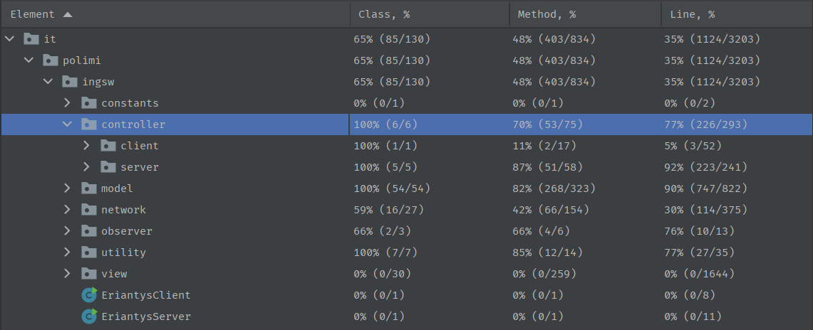

# Software Engineering Project 2022

The aim of the project is the design and implementation of a board game ([Eriantys](https://www.craniocreations.it/prodotto/eriantys/)) through a client-server application.

Prof. Alessandro Margara

## Team members

- [Giovanni De Lucia](https://github.com/gio-del) mail: giovanni.delucia@polimi.it
- [Lorenzo Dell'Era](https://github.com/LorenzoDellera) mail: lorenzo.dellera@polimi.it
- [Lorenzo Battiston](https://github.com/lorenzo-battiston) mail: lorenzo1.battiston@polimi.it

| Functionality     | State |
|:------------------|:-----:|
| Basic rules       |  🟢   |
| Complete rules    |  🟢   |
| Socket            |  🟢   |
| GUI               |  🟢   |
| CLI               |  🟢   |
| Multiple games    |  🟢   |
| All Characters    |  🟢   |
| 4 players support |  🔴   |
| Persistence       |  🔴   |

## Jars
Jars can be found [here](deliverables/final/jars). If you want to generate them, type `mvn clean package` in the root of the project.
The Jars will be generated in a new `/target` folder.
Java 18 or higher version is needed to play this game.

## Execution

### Server
To start the server type `java -jar AM23Eriantys_server.jar [--port|-p <portNumber>]` in your terminal.
The default port number (if incorrect syntax is used or no port number is provided) is 17000.

### Client
#### CLI
To start the CLI type `java -jar AM23Eriantys_client.jar [--cli | -c]` in your terminal.
#### GUI
To start the GUI type `java -jar AM23Eriantys_client.jar` in your terminal or just double-click the executable file.

## Coverage
Detailed coverage report can be found [here](deliverables/final/coverage_report).

## UML
UML files can be found [here](deliverables/final/uml_final).